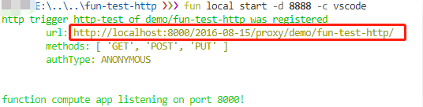
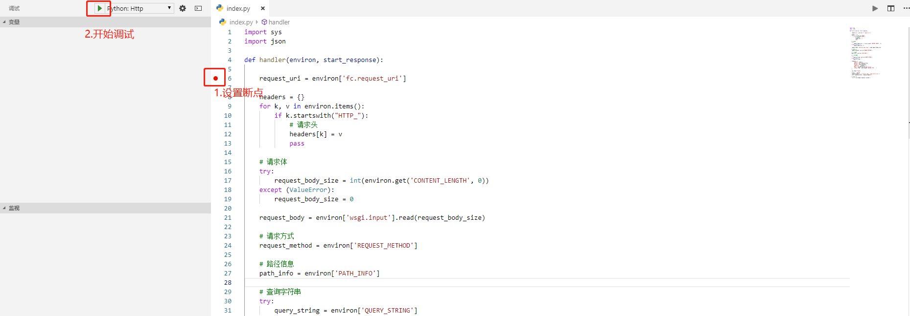
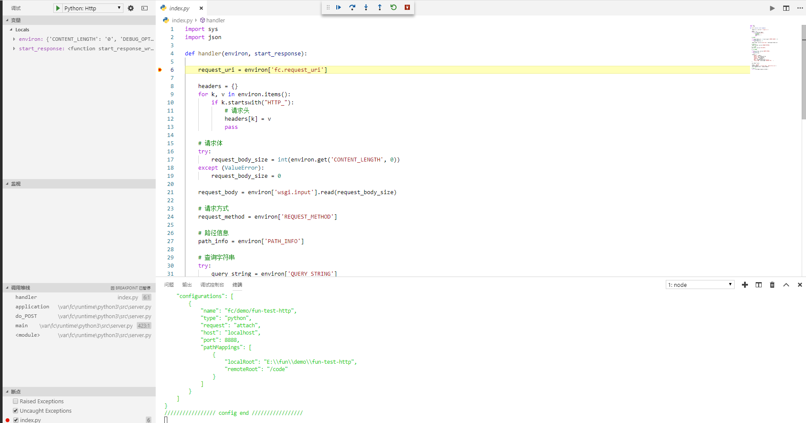
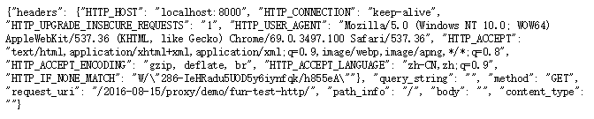

# 阿里云函数计算使用Python3带Http触发器模板
目前阿里云函数计算支持Http触发器，由于Http触发器使用得比较多，特意制作一个模板，可以直接下载该模板使用。另外，模板自带VScode调试功能，方便调试。

## 安装模板
- 安装nodejs

- 安装docker和fun，官方参考教程：[安装教程](https://github.com/aliyun/fun/blob/master/docs/usage/installation-zh.md)

- 初始化模板

  ```shell
  fun init -n fun-test-http https://github.com/l616769490/python3-http-example.git
  ```

  可以将【fun-test-http】替换成你自己的文件夹名

## 使用模板
- 使用vscode打开模板文件夹

- 打开终端，运行调试命令：fun local start -d 8888 -c vscode，控制台会自动输出调试链接

  

- 按住ctrl并单击链接，即可浏览器中打开调试链接。或者直接复制链接在浏览器中打开。

- 调试程序
 
 

- 调试完成后可以在浏览器中看到返回结果
 


## 参考资料
- [阿里云官方示例](https://github.com/aliyun/fun/tree/master/examples/local_http)
